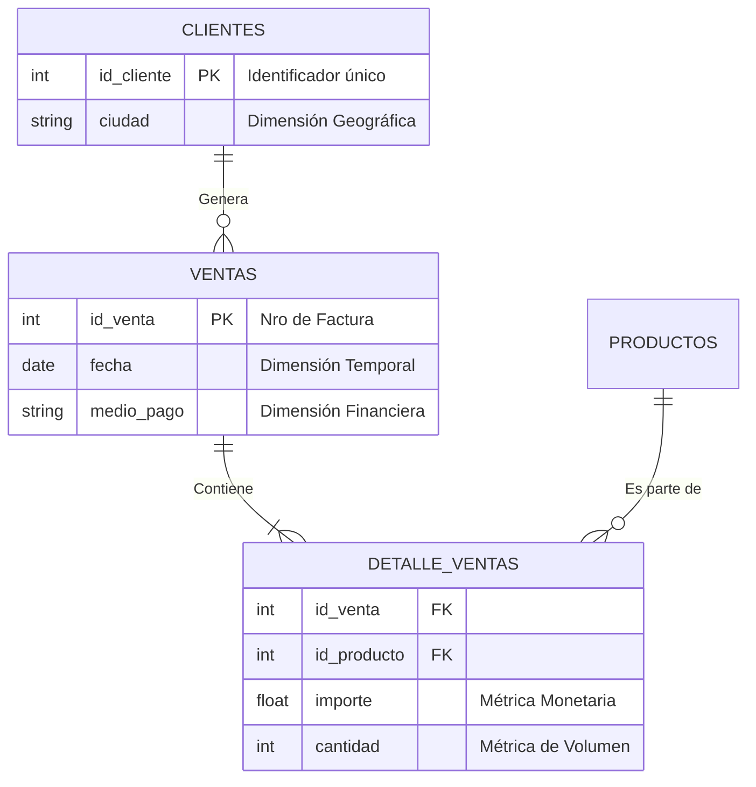

# 📘 Informe Técnico: Sistema de Inteligencia de Negocios - Tienda Aurelion

## 1\. Resumen Ejecutivo

Este proyecto implementa una solución de **Business Intelligence (BI)** automatizada. El objetivo es transformar datos crudos transaccionales y maestros (dispersos en múltiples fuentes CSV) en un tablero de control visual que permita la toma de decisiones estratégicas basadas en datos (*Data-Driven Decision Making*).

El sistema responde a preguntas críticas de negocio sobre:

  * Rendimiento de productos (Volumen vs. Rentabilidad).
  * Comportamiento y retención de clientes.
  * Tendencias estacionales de ventas.
  * Distribución geográfica y preferencias de pago.

## 2\. Arquitectura de Datos

El modelo de datos sigue un esquema de **Estrella (Star Schema)** simplificado, donde la tabla de "Detalle de Ventas" actúa como tabla de hechos central, enriquecida por dimensiones.

### 2.1 Diccionario de Datos (Fuentes)

| Archivo Fuente| Tipo  | Descripción | Campos Críticos (Key Features) |

| `ventas.csv` | **Transaccional** | Cabecera de facturas. Registra el evento de venta. | `id_venta` (PK), `fecha`, `id_cliente` (FK), `medio_pago`. |

| `detalle_ventas.csv` | **Transaccional** | Desglose de ítems. Qué productos específicos se vendieron en cada factura. | `id_venta` (FK), `id_producto` (FK), `cantidad`, `importe`. |

| `productos.csv` | **Maestro** | Catálogo de inventario con atributos fijos. | `id_producto` (PK), `nombre`, `categoria`, `precio`. |

| `clientes.csv` | **Maestro** | Base de datos de usuarios registrados. | `id_cliente` (PK), `nombre`, `ciudad`, `email`. |

### 2.2 Diagrama de Entidad-Relación (ERD)



## 3\. Metodología ETL (Extract, Transform, Load)

El núcleo del script es la función `obtener_dataset_maestro()`, que realiza la ingeniería de datos necesaria para el análisis.

### 3.1 Extracción y Limpieza

  * **Ingesta:** Lectura de archivos CSV mediante `pandas`.
  * **Casteo de Tipos:** Conversión de la columna `fecha` (string) a objeto `datetime` para permitir re-muestreo temporal (Time Series Analysis).

### 3.2 Estrategia de Fusión (Data Merging)

Se realiza una **unión en cascada** para construir una "Single Source of Truth" (Fuente Única de Verdad).

1.  **Nivel 1 (Factura Completa):** `Inner Join` entre *Detalle* y *Ventas*.
      * *Objetivo:* Asociar cada ítem vendido con la fecha y el medio de pago de su factura correspondiente.
2.  **Nivel 2 (Enriquecimiento de Producto):** `Left Join` con *Productos*.
      * *Desafío Técnico:* Colisión de nombres. La columna `nombre_producto` existe en *Detalle* y en *Productos*.
      * *Solución:* Uso de `suffixes=('', '_dup')` para aislar duplicados y mantener limpia la columna original.
3.  **Nivel 3 (Enriquecimiento de Cliente):** `Left Join` con *Clientes*.
      * *Objetivo:* Agregar dimensiones demográficas (Ciudad) a cada transacción.

## 4\. Definición de KPIs y Métricas

El análisis se divide en 5 módulos estratégicos. A continuación se detalla la lógica de negocio de cada uno:

### 📊 Módulo A: Rendimiento de Producto

Analiza el inventario desde dos perspectivas:

1.  **Rotación (Volumen):** $\sum \text{Cantidad Vendida}$. Identifica productos "gancho" que atraen tráfico.
2.  **Rentabilidad (Ingresos):** $\sum \text{Importe Monetario}$. Identifica productos "estrella" que sostienen el flujo de caja.

### 📈 Módulo B: Análisis Temporal

Analiza la salud financiera a lo largo del tiempo.

  * **Lógica:** Agrupación `(resample)` por mes (`YYYY-MM`).
  * **Utilidad:** Permite detectar estacionalidad (ej. picos en Navidad) o tendencias negativas que requieran intervención de marketing.

### 👥 Módulo C: Valor de Cliente (Pareto)

Identifica a los clientes VIP.

  * **Lógica:** Ranking descendente por $\sum \text{Gasto Total Histórico}$.
  * **Insight:** Generalmente, el 20% de los clientes genera el 80% de los ingresos. Este módulo ayuda a validar esa regla.

### 📦 Módulo D: Diversificación por Categoría

Evalúa la dependencia del negocio respecto a ciertos rubros (ej. Alimentos vs. Limpieza).

  * **Visualización:** Gráfico de barras comparativo. Ayuda a equilibrar el catálogo.

### 💳 Módulo E: Preferencias Financieras y Geografía

1.  **Medios de Pago:** Análisis de *Share* (Cuota) de transacciones.
      * *Nota Técnica:* Se realiza sobre `id_venta` únicos para no contar el medio de pago múltiples veces por factura.
      * *Importancia:* Ayuda a negociar comisiones con proveedores de tarjetas o incentivar pagos en efectivo.
2.  **Geografía:** Ventas totales por Ciudad. Fundamental para logística y campañas localizadas.

## 5\. Guía de Uso del Código

### Requisitos Previos

El entorno debe tener instaladas las librerías científicas de Python:

```bash
pip install pandas matplotlib seaborn
```

### Ejecución

El script está estructurado modularmente. Al ejecutar el archivo principal (`main`), el flujo es:

1.  **Carga:** El sistema busca los archivos `.csv` en el directorio raíz.
2.  **Procesamiento:** Se imprime en consola el estado de la fusión de datos (`df_maestro`).
3.  **Visualización:** Se despliegan secuencialmente 6 ventanas gráficas interactivas correspondientes a los módulos de análisis.

## 6\. Conclusiones y Próximos Pasos (Futuras Mejoras)

Actualmente, el sistema proporciona un análisis descriptivo robusto. Para escalar el proyecto, se sugieren las siguientes mejoras:

  * **Análisis de Ticket Promedio:** Calcular cuánto gasta un cliente promedio por visita.
  * **Análisis de Cohortes:** Evaluar la retención de clientes a lo largo del tiempo (ej. ¿Los clientes de enero volvieron en febrero?).
  * **Exportación Automática:** Generar un reporte en PDF o Excel con los gráficos incrustados automáticamente.